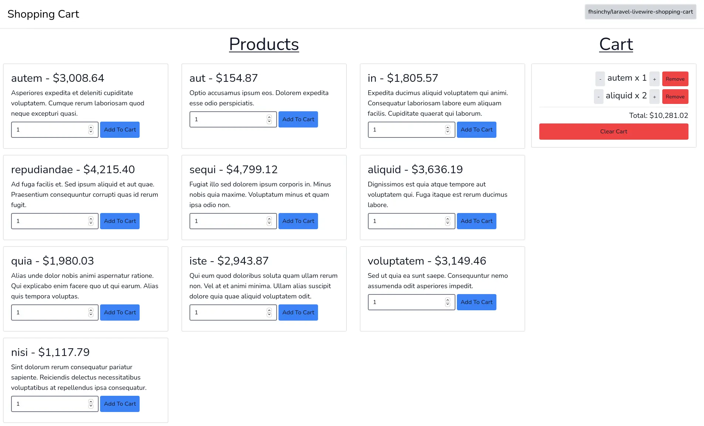

# Real-time Shopping Cart

This is a simple real-time shopping cart implementation powered by [Laravel](https://laravel.com/), [Livewire](https://laravel-livewire.com/) and [TailwindCSS](https://tailwindcss.com/) projects. This project was created in an attempt to demonstrate the usage of [service classes in Laravel](https://farhan.info//laravel-service-classes-explained/)



Steps for running the project locally are as follows:

```sh
git clone https://github.com/fhsinchy/laravel-livewire-shopping-cart.git

cd laravel-livewire-shopping-cart
cp .env.example .env
touch database/database.sqlite

composer install
php artisan key:generate
php artisan migrate --seed

php artisan serve
```

The application should be available on `http://127.0.0.1:8000` address. If you like my works, you can [buy me a coffee](https://buymeacoffee.com/farhanhasin/).
